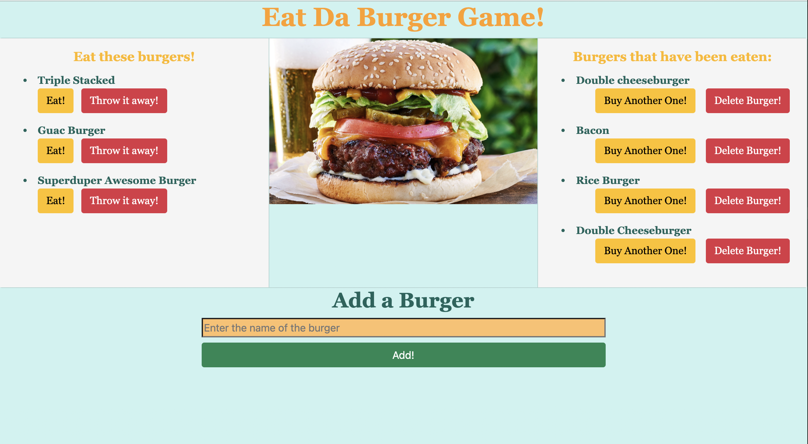

# Eat-Da-Burger Application

This application allows the user to eat any burger they choose and buy more burgers if they are still hungry. They can even add more burgers to the list.

## Deployed Application

[Click here to access the deployed app on Heroku](https://salty-beach-03284.herokuapp.com/)

## Demo




## Specifications For This Application

* All of the burgers are stored in a database on MySQL.
* Handlebars is used to create the unique html.

## Installation

If you would like to try this application on your own:

* fork this repo

```
npm install

npm install mysql

node server.js
```

## Sources
* [Burger image used in the app](https://media1.s-nbcnews.com/i/newscms/2019_21/2870431/190524-classic-american-cheeseburger-ew-207p_d9270c5c545b30ea094084c7f2342eb4.jpg)

* [Coolors](https://coolors.co/) This website was used for color inspiration for this application.
